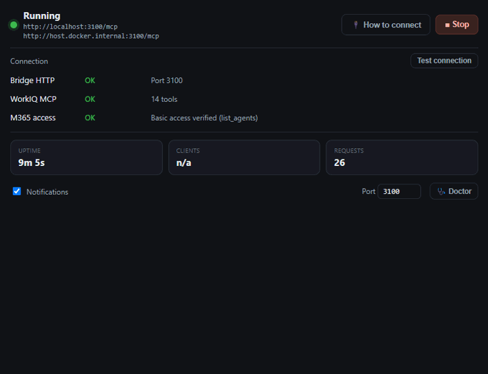

# workiq-mcp-bridge

Run the stdio-only [WorkIQ MCP](https://www.npmjs.com/package/@microsoft/workiq) server as an HTTP endpoint your **devcontainers** — and your host VS Code — can share, via [supergateway](https://github.com/supercorp-ai/supergateway).

WorkIQ authenticates against your registered Windows host and speaks stdio only. This bridge wraps it and exposes streamable HTTP on `localhost:3100/mcp`, so a container can reach it through `host.docker.internal` with no separate registration.

Two ways to run the bridge:

| | [Desktop app](#desktop-app-recommended) | [PowerShell script](#powershell-script) |
|---|---|---|
| Best for | Daily use — click to start, lives in the tray | Headless / CI / quick one-off |
| Terminal | Not needed | Stays open while running |
| Watchdog | Restarts on crash | No |
| Health / logs | Live in a window | `-Test` on demand |

---

## Where does the WorkIQ MCP run?

Always on your **Windows host** — never inside the container. The bridge launches it (`npx @microsoft/workiq mcp`) as a child process and translates its stdio to HTTP. What changes is only how you connect:

```
                      Windows host (:3100)
                 ┌───────────────────────────┐
                 │  bridge (app or script)   │
                 │    └─ supergateway        │
                 │         └─ workiq mcp     │   stdio <-> HTTP
                 └───────────────────────────┘
                    ^                     ^
     localhost:3100 │                     │ host.docker.internal:3100
        ┌───────────┴──────┐   ┌──────────┴────────────┐
        │ VS Code (host)   │   │ VS Code (devcontainer)│
        └──────────────────┘   └───────────────────────┘
```

- **Host VS Code** connects to `http://localhost:3100/mcp`.
- **A devcontainer** connects to `http://host.docker.internal:3100/mcp`.

One running bridge serves both.

---

## Desktop app (recommended)

A minimalist Windows tray app (Electron) under [`app/`](app/) that runs and monitors the bridge:



- **Start/stop on demand** — no terminal to keep open; lives in the system tray.
- **Watchdog** — restarts the bridge if it crashes; a manual stop stays stopped.
- **Live status, health, and logs** in one window.
- **How to connect** — one click reveals the host or devcontainer MCP snippet, ready to copy.
- **Doctor** — checks Node/npx, WorkIQ registration, firewall, and port; adds the firewall rule for you.
- **Toast notifications** when the bridge goes down.

### Download

Grab the latest prebuilt `.exe` from the [**Releases**](https://github.com/datorresb/workiq-mcp-bridge/releases/latest) page:

- **Installer** — `WorkIQ MCP Bridge Setup <version>.exe`; installs to your user profile with a Start-menu shortcut.
- **Portable** — `WorkIQ MCP Bridge-<version>-portable.exe`; run it directly, no install.

The build is unsigned, so Windows SmartScreen may warn on first run — choose **More info → Run anyway**.

### Run from source

```powershell
cd app
npm install
npm start
```

### Build an installer / portable exe

```powershell
cd app
npm run dist
```

Outputs `WorkIQ MCP Bridge Setup <version>.exe` (installer) and `WorkIQ MCP Bridge-<version>-portable.exe` under `app/dist-package/`.

---

## PowerShell script

The original single-file bridge — no build step, good for headless use.

### 1. First-time setup (once)

Open the firewall for Docker (auto-elevates — accept the UAC prompt):

```powershell
.\start-workiq-bridge.ps1 -Firewall
```

### 2. Start the bridge

```powershell
.\start-workiq-bridge.ps1
```

Leave the terminal open. Runs until you close it or press `Ctrl+C`.

### 3. Configure your devcontainer

Add to `devcontainer.json`, then rebuild the container:

```jsonc
{
  "customizations": {
    "vscode": {
      "settings": {
        "mcp": {
          "servers": {
            "workiq": { "url": "http://host.docker.internal:3100/mcp" }
          }
        }
      }
    }
  }
}
```

For host VS Code, use `http://localhost:3100/mcp` instead.

### Commands

| Command | Description |
|---------|-------------|
| `.\start-workiq-bridge.ps1` | Start the bridge (default port 3100) |
| `.\start-workiq-bridge.ps1 -Port 4000` | Use a custom port |
| `.\start-workiq-bridge.ps1 -Stop` | Stop the bridge |
| `.\start-workiq-bridge.ps1 -Test` | Verify the bridge is healthy |
| `.\start-workiq-bridge.ps1 -Firewall` | Add the Windows Firewall rule (once) |

---

## Requirements

- Windows with Node.js (for `npx`)
- WorkIQ registered on your machine — run `npx @microsoft/workiq` once
- Docker Desktop — only for the devcontainer path

## Repository layout

```
start-workiq-bridge.ps1   # the script bridge
app/                       # the desktop app (Electron + TypeScript)
  src/main/                #   process supervision, health, tray, logs
  src/renderer/            #   single-window UI
  smoke/                   #   staged integration checks
docs/plans/                # implementation plan
```

## License

MIT
