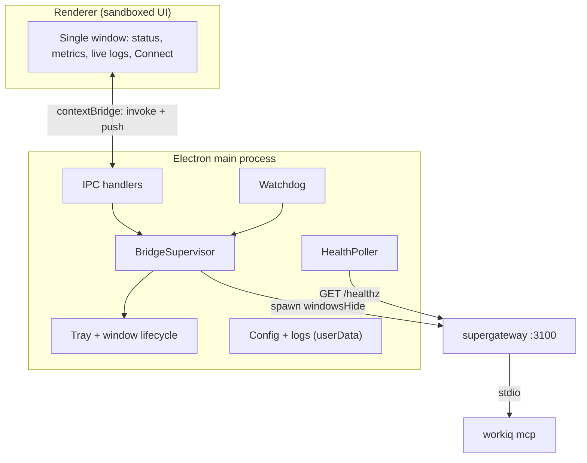
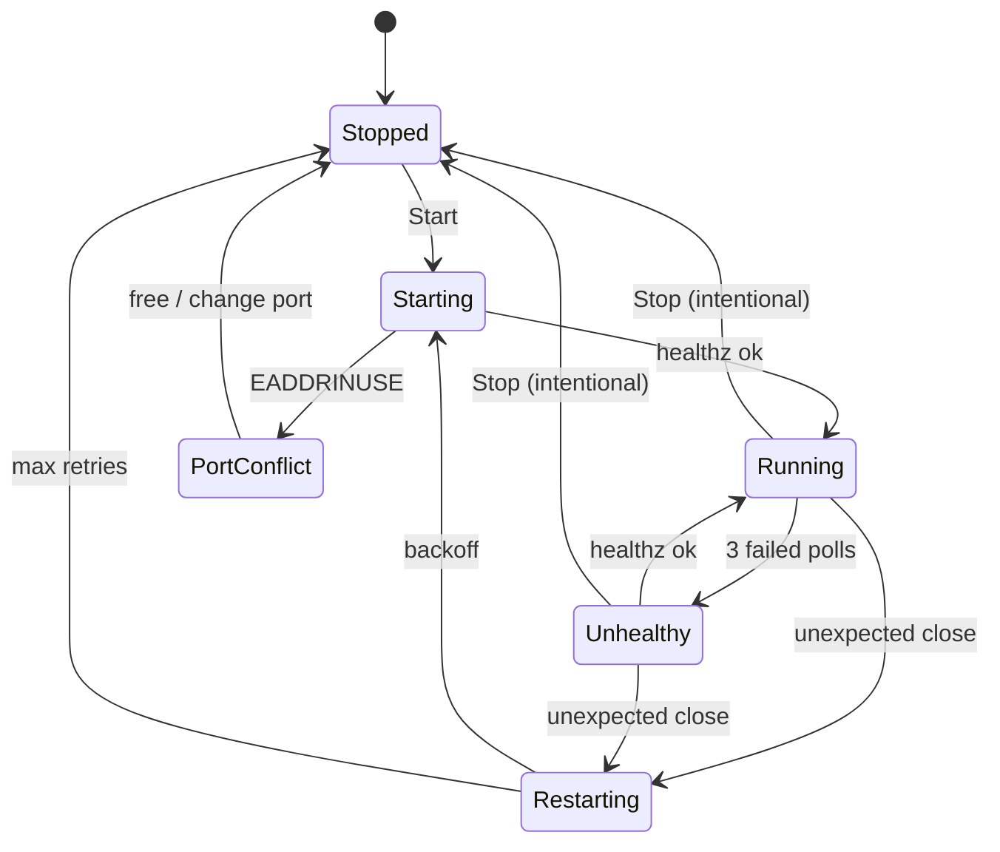

# WorkIQ Bridge Manager - Plan

## Goal Capsule

- **Objective:** A minimalist Windows tray desktop app (Electron) that runs and manages the WorkIQ MCP bridge on demand — one window showing live status, health, metrics, and logs — replacing the "keep a terminal open and run a script" workflow.
- **Product authority:** @datorresb. Primarily a personal developer tool, packaged so it can be shared as a Windows executable.
- **Execution profile:** Greenfield Electron + TypeScript app under `app/`. Build incrementally behind the `app/smoke/` stub harness — each `NN_` stub green before its dependent unit is done.
- **Stop conditions:** Surface a genuine blocker (a decision that changes scope or contradicts this plan) instead of guessing. Do not weaken or mock a failing smoke/test to make it pass.
- **Tail ownership:** Follow the plan's PR/landing strategy; repo conventions and user preferences override it.
- **Open blockers:** None. Nothing in `Resolve Before Planning`; Outstanding Questions are all deferred (non-blocking) and answered during implementation.

---

## Product Contract

### Summary

A single-window Electron app that lives in the Windows system tray and controls the WorkIQ MCP bridge (`supergateway` wrapping `npx @microsoft/workiq mcp`). It starts/stops the bridge at will, auto-starts hidden on login, keeps it alive with a watchdog, shows live health and logs, and offers copy-paste connection snippets for both host VS Code and devcontainers. UI in English; shippable as a Windows executable.

### Problem Frame

Today the bridge is a foreground PowerShell script (`start-workiq-bridge.ps1`). Running it means keeping a terminal window open for the whole session; there is no at-a-glance signal that the bridge is healthy (you must run `-Test` by hand); it does not survive a reboot or start on login; and when a devcontainer cannot reach WorkIQ there are no historical logs to debug from. The bridge is a dependency for Copilot inside devcontainers, so a silent death breaks WorkIQ tooling with no visible cause.

### Key Decisions

- **App replaces the script and owns the process tree.** The app spawns and supervises `Electron → supergateway → workiq mcp` directly, rather than shelling out to the PowerShell script. This is what makes live logs, health polling, and the watchdog possible.
- **The bridge serves host and containers; the app is the single control point.** `supergateway` exposes streamable HTTP on port 3100, reachable as `localhost:3100/mcp` from the host and `host.docker.internal:3100/mcp` from a devcontainer. Both host VS Code and containers can share one managed WorkIQ instance.
- **Manual Stop is authoritative.** The watchdog restarts only unexpected crashes, never a user-initiated Stop, and backs off after repeated failures instead of looping.
- **Click over hover for copy-paste UI.** The Connect panel opens on click and stays open so snippets can be selected and copied. Hover is reserved for short tooltips only.
- **Metrics are tiered.** Status, health, uptime, and port are guaranteed; connected-client and request counts are shown only if `supergateway` exposes them, otherwise marked unavailable.
- **English UI, Windows-only for v1.**

### Requirements

Rendered as a checklist — each item is "done" when the box can be checked.

**Lifecycle & tray**
- R1. [ ] Start and stop the bridge on demand by spawning/killing the `supergateway → workiq mcp` process tree on the host.
- R2. [ ] Present a single window with status, uptime, port, metrics, and a live log pane.
- R3. [ ] Live in the system tray; minimize to tray; be able to run with no visible window.
- R4. [ ] Offer a "Start with Windows" toggle that can launch the app hidden and start the bridge on login.
- R5. [ ] Allow the listen port to be configured (default 3100).
- R6. [ ] Enforce a single running instance of the app.

**Health & reliability**
- R7. [ ] Poll health automatically by performing the MCP `initialize` handshake against `/mcp` on an interval and reflect ✓ / ✗ in the UI.
- R8. [ ] Watchdog: automatically restart the bridge after an unexpected crash, never after a manual Stop, with bounded retries/backoff on repeated failure.
- R9. [ ] Detect a port already in use on Start and offer to free it or change the port instead of failing.
- R10. [ ] Reflect state in the tray icon (color) and tooltip (running / stopped / unhealthy).
- R11. [ ] Fire a system toast when the bridge goes down or unhealthy, with a toggle to silence.

**Logs**
- R12. [ ] Stream the bridge child process stdout/stderr as live logs in the window.
- R13. [ ] Persist logs to a rolling file so history survives restarts.
- R14. [ ] Provide a one-click Copy for the logs (copy only in v1).

**Connect & setup**
- R15. [ ] A "Connect" panel that opens on click and stays open, showing host (`localhost:3100/mcp`) and devcontainer (`host.docker.internal:3100/mcp`) MCP config snippets, each with a Copy button and short setup steps.
- R16. [ ] A first-run "Doctor" that checks Node/npx availability, WorkIQ host registration, the Windows firewall rule, and port availability, and can add the firewall rule (elevating via UAC).

**Packaging**
- R17. [ ] All app UI text in English.
- R18. [ ] Ship as a Windows executable (installer plus portable `.exe`).

### Key Flows

- F1. Auto-start on login
  - **Trigger:** User logs into Windows with "Start with Windows" enabled.
  - **Steps:** App launches to tray with no window; bridge starts; health poll begins; tray icon turns green when healthy.
  - **Covers:** R3, R4, R7, R10.
- F2. Crash vs manual stop
  - **Trigger:** The bridge child process exits.
  - **Steps:** If the exit was unexpected, the watchdog restarts it and logs the event plus (if enabled) a toast; if the exit followed a user Stop, nothing restarts.
  - **Covers:** R8, R11, R12.
- F3. Connect a client
  - **Trigger:** User clicks Connect.
  - **Steps:** Panel opens and stays open; user copies the host or devcontainer snippet, pastes it into their MCP config, and reloads the window.
  - **Covers:** R15.

### Acceptance Examples

Clear, testable criteria — render as a checklist.

- AE1. [ ] **Given** the bridge is stopped, **When** the user clicks Start, **Then** within a bounded time the handshake at `http://localhost:3100/mcp` returns HTTP 200 and the UI shows Running + healthy. **Covers R1, R7.**
- AE2. [ ] **Given** the bridge is running, **When** the user clicks Stop, **Then** the process tree is terminated **and** the watchdog does not restart it. **Covers R8.**
- AE3. [ ] **Given** the bridge is running, **When** the child process crashes unexpectedly, **Then** the watchdog restarts it and a log entry (and toast, if enabled) is produced. **Covers R8, R11, R12.**
- AE4. [ ] **Given** the port is already in use, **When** the user clicks Start, **Then** the app reports the conflict and offers to free or change the port, without entering a restart loop. **Covers R9.**
- AE5. [ ] **Given** health polling fails on consecutive attempts past the threshold, **When** the bridge is unhealthy, **Then** the tray icon turns red, the health indicator shows ✗, and a toast fires if enabled. **Covers R7, R10, R11.**
- AE6. [ ] **Given** the user clicks Connect, **When** the panel opens, **Then** it shows both the host and devcontainer snippets with working Copy buttons and stays open when the mouse moves away. **Covers R15.**
- AE7. [ ] **Given** a first run, **When** the user opens Doctor, **Then** it reports pass/fail for Node/npx, WorkIQ registration, firewall rule, and port, and the firewall fix triggers a UAC prompt. **Covers R16.**
- AE8. [ ] **Given** "Start with Windows" and "start hidden" are enabled, **When** the user logs into Windows, **Then** the app launches to the tray with no window and the bridge starts. **Covers R3, R4.**

### Validation & Smoke Testing

Build incrementally behind a `smoke/` folder of staged, numbered stub scripts, each proving one layer before the UI is wired on top. Get each stub green before layering the next feature — this catches integration errors early, independent of the Electron shell.

- `smoke/00_handshake.*` — POST the MCP `initialize` request to `http://localhost:3100/mcp` with `Accept: application/json, text/event-stream`; expect HTTP 200. This mirrors the existing script's `-Test` and is the cheapest possible signal that the bridge is up and speaks MCP. No client required.
- `smoke/01_spawn.*` — spawn and kill the `supergateway → workiq mcp` tree; confirm clean start and full teardown (no orphaned child).
- `smoke/02_watchdog.*` — kill the child out from under the app; confirm auto-restart. Then perform a manual Stop; confirm no restart.
- `smoke/03_health-loop.*` — run the handshake on a loop; confirm the ✓/✗ transitions the UI will consume.

Client-level verification, from cheapest to most realistic:
- **Programmatic handshake** (the `00_` stub) — fast inner loop, scriptable.
- **MCP Inspector** (`npx @modelcontextprotocol/inspector`) — interactively list and call the real WorkIQ tools through the bridge.
- **VS Code + Copilot** — the real end-to-end client, both host (`localhost`) and inside a devcontainer (`host.docker.internal`).
- **Copilot Desktop** — usable only if it supports adding an MCP server over HTTP; verify that before relying on it. VS Code is the documented target and the safer default.

### Scope Boundaries

**Deferred for later**
- Log export and "open logs folder" — v1 ships copy-only (R14).
- macOS / Linux builds — Windows-only for v1.
- In-app language selector — English only for v1.

**Outside this product's identity**
- Auto-editing `devcontainer.json` / `mcp.json` — Connect copies snippets; the user pastes them.
- Replacing WorkIQ host registration/auth — the bridge relies on the host's existing registration; Doctor only checks it.

### Dependencies / Assumptions

- Requires Node.js / `npx` on the host and WorkIQ registered on the host; Docker Desktop is needed only for the devcontainer path.
- Assumes `supergateway` binds so both `localhost` and `host.docker.internal` can reach the port; the Windows firewall rule is required for container access (covered by Doctor / firewall fix).
- Assumes `supergateway` may not expose per-client or per-request metrics; those cards are best-effort.
- Windows-only host for v1.

### Outstanding Questions

Deferred to Planning (none block planning):
- Health-poll interval and the consecutive-failure threshold for "unhealthy" (working defaults: ~10s, 3 failures).
- Whether and how `supergateway` surfaces connected-client / request-count metrics.
- Log-file rotation size and retention.
- Electron packaging specifics (installer + portable target configuration).

---

## Planning Contract

**Product Contract preservation:** changed R7 — generalized the health mechanism from "MCP `initialize` handshake against `/mcp`" to a liveness/health probe; KTD-3 records polling supergateway's `--healthEndpoint /healthz` and reserving the full `initialize` handshake for an on-demand deep check. All other Product Contract requirements unchanged.

### Key Technical Decisions

- KTD-1. Electron + TypeScript, single `BrowserWindow`, vanilla HTML/CSS/TS renderer (no SPA framework). All process supervision, health polling, and log capture live in the main process; the renderer is a pure sandboxed UI. Rationale: one minimalist window doesn't need a framework, and child processes are main-only.
- KTD-2. Control the process tree with the `tree-kill` package (delegates to `taskkill /PID <pid> /T /F` on Windows). Spawn supergateway with `windowsHide: true`, `stdio: ['ignore','pipe','pipe']`, `detached: false`. Rationale: `npx` spawns a grandchild tree (npx → node → supergateway → npx → workiq); killing only the root PID orphans children still holding the port. Ignore `EPERM`/`ESRCH` on kill.
- KTD-3. Poll health via supergateway `--healthEndpoint /healthz` (`GET /healthz` every ~10s, 5s timeout, 3 consecutive failures → unhealthy). Rationale: in stateless streamable-HTTP mode every `initialize` POST to `/mcp` spawns a fresh workiq child — too costly to poll. Keep a full `initialize` POST (Accept: `application/json, text/event-stream`) as an on-demand deep check.
- KTD-4. Watchdog = supervisor with an `intentionalStop` flag set synchronously before `tree-kill`, evaluated in the child `close` handler; unexpected close → exponential backoff restart (cap ~5 attempts, 30s max), attempts reset after stable uptime. Rationale: distinguishes a manual Stop (KD3) from a crash and avoids restart loops on persistent failure (e.g., port conflict).
- KTD-5. Auto-launch via Electron `app.setLoginItemSettings({ openAtLogin, path: execPath, args: ['--openAsHidden'], name, enabled })`; detect `--openAsHidden` in `process.argv` to start hidden to tray. Rationale: the built-in API covers the Windows Run key plus the Startup-approved entry with no extra dependency (`openAsHidden` boolean is macOS-only).
- KTD-6. Secure renderer: `contextIsolation: true`, `nodeIntegration: false`, `sandbox: true`, `preload` + `contextBridge`. Renderer receives pushed status/log/metrics via `webContents.send` and calls via `ipcRenderer.invoke`.
- KTD-7. Persist state under `app.getPath('userData')` (`%APPDATA%\WorkIQ MCP Bridge`): `settings.json` (port, autostart, notify toggle) and a rolling log file. Works identically for installed and portable builds.
- KTD-8. Package with `electron-builder` (targets `nsis` + `portable`, x64); `build/icon.ico`; set AUMID via `app.setAppUserModelId(appId)` before any window. Rationale: builder supports a portable target with minimal single-dev config; forge does not.
- KTD-9. Metrics tiering: status, health, uptime, and port are computed locally (guaranteed); connected-client and request counts are parsed best-effort from supergateway stdout and shown as `n/a` when unavailable.

### High-Level Technical Design

Component and process topology:



Bridge lifecycle state machine:



### Assumptions

- `@microsoft/workiq` is invoked exactly as today (`npx -y @microsoft/workiq mcp`); it is not a public npm package, so the command is taken as-given.
- The Node runtime bundled with the target Electron version can run `npx -y @microsoft/workiq mcp` (verify early).
- The installed `supergateway` version supports `--healthEndpoint`.

### Sequencing

Phase 1 Foundation (U1→U2→U3) → Phase 2 Reliability (U4) → Phase 3 Shell & UI (U5, U6, U7, U8) → Phase 4 Guidance, alerts, setup, packaging (U9, U10, U11, U12).

---

## Output Structure

```text
app/
  package.json            # deps, scripts, electron-builder "build" stanza
  tsconfig.json
  build/
    icon.ico              # app + installer icon (multi-res)
    tray-green.ico        # tray states
    tray-gray.ico
    tray-red.ico
  src/
    main/
      main.ts             # app lifecycle, single-instance, window, AUMID
      supervisor.ts       # spawn/stop tree, log capture
      health.ts           # /healthz polling + deep initialize check
      watchdog.ts         # crash-vs-stop restart with backoff
      port.ts             # EADDRINUSE probe + holder lookup
      tray.ts             # state icon, tooltip, menu, click/hide
      autostart.ts        # setLoginItemSettings + hidden launch
      notifications.ts    # toast on down/unhealthy
      doctor.ts           # first-run checks + firewall fix
      logs.ts             # rolling log file in userData
      config.ts           # settings.json (port, autostart, notify)
      ipc.ts              # ipcMain handlers + push wiring
    preload/
      preload.ts          # contextBridge bridgeAPI
    renderer/
      index.html
      renderer.ts         # single-view UI + subscriptions
      connect.ts          # Connect panel
      styles.css
  smoke/
    00_handshake.mjs      # POST initialize → 200
    01_spawn.mjs          # start/stop tree, assert port freed
    02_watchdog.mjs       # external-kill → restart; manual-stop → no restart
    03_health-loop.mjs    # /healthz ✓/✗ transitions
```

The existing `start-workiq-bridge.ps1` stays at the repo root as a headless fallback; the app does not call it (it spawns supergateway directly per KTD-2).

---

## Implementation Units

| U-ID | Title | Key files | Depends on |
|---|---|---|---|
| U1 | Scaffold, build tooling, smoke harness | `app/package.json`, `app/src/main/main.ts` | — |
| U2 | Bridge supervisor (spawn/stop/logs) | `app/src/main/supervisor.ts` | U1 |
| U3 | Health polling + configurable port | `app/src/main/health.ts` | U2 |
| U4 | Watchdog + port-conflict handling | `app/src/main/watchdog.ts`, `app/src/main/port.ts` | U2, U3 |
| U5 | Tray + window lifecycle + single instance | `app/src/main/tray.ts`, `app/src/main/main.ts` | U1 |
| U6 | Auto-start on Windows + start hidden | `app/src/main/autostart.ts` | U5 |
| U7 | Secure IPC + single-window renderer | `app/src/preload/preload.ts`, `app/src/renderer/*` | U2, U3, U5 |
| U8 | Log persistence + copy | `app/src/main/logs.ts` | U7 |
| U9 | Connect panel | `app/src/renderer/connect.ts` | U7 |
| U10 | Toast notifications | `app/src/main/notifications.ts` | U3, U7 |
| U11 | First-run Doctor (+ firewall fix) | `app/src/main/doctor.ts` | U7 |
| U12 | Packaging & release | `app/package.json`, `app/build/*` | all |

### U1. Scaffold, build tooling, and smoke harness

- **Goal:** A buildable Electron + TypeScript project under `app/` that opens one blank window and quits cleanly, with the `smoke/` folder skeleton.
- **Requirements:** R17, R18 (scaffolding); enables all units.
- **Dependencies:** none.
- **Files:** `app/package.json`, `app/tsconfig.json`, `app/src/main/main.ts`, `app/src/preload/preload.ts`, `app/src/renderer/index.html`, `app/src/renderer/renderer.ts`, `app/src/renderer/styles.css`, `app/smoke/README.md`.
- **Approach:** TypeScript compiled with `tsc`; one `BrowserWindow` with `contextIsolation`/`sandbox`/`preload` (KTD-1, KTD-6); set AUMID at startup (KTD-8); add the electron-builder `build` stanza (targets deferred to U12). English UI shell only.
- **Patterns to follow:** Electron quick-start; research brief §6, §10.
- **Test scenarios:** Test expectation: none — scaffolding. Smoke: `cd app && npm run build` succeeds; `npm start` opens a window and exits cleanly.
- **Verification:** build passes; app launches to an empty window; `electron-builder` reads the config without error.

### U2. Bridge supervisor (spawn/stop/logs)

- **Goal:** A `BridgeSupervisor` (main) that spawns the supergateway→workiq tree, streams stdout/stderr as `log` events, and stops the whole tree.
- **Requirements:** R1, R12.
- **Dependencies:** U1.
- **Files:** `app/src/main/supervisor.ts`, `app/src/main/config.ts`, `app/smoke/01_spawn.mjs`.
- **Approach:** `spawn('npx', ['-y','supergateway','--stdio','npx -y @microsoft/workiq mcp','--port',port,'--outputTransport','streamableHttp','--healthEndpoint','/healthz'], { windowsHide: true, stdio: ['ignore','pipe','pipe'] })` (KTD-2, KTD-3); emit `log` per line and `statusChange`; Stop = `tree-kill(pid,'SIGKILL')`, ignoring `EPERM`/`ESRCH`.
- **Patterns to follow:** research brief §1, §2.
- **Test scenarios:** Covers AE1 (partial). Happy: Start yields a `pid` and stdout lines emit as `log`. Stop terminates the tree — 01_spawn asserts the port is free afterward (no orphans). Edge: a second Start while running is a guarded no-op; Stop while stopped is a no-op. Error: `npx` missing surfaces an error log + stopped status.
- **Verification:** `node app/smoke/01_spawn.mjs` starts then stops the tree and confirms the port is released.

### U3. Health polling + configurable port

- **Goal:** Poll `/healthz` to derive healthy/unhealthy and make the listen port configurable.
- **Requirements:** R5, R7.
- **Dependencies:** U2.
- **Files:** `app/src/main/health.ts`, `app/src/main/config.ts`, `app/smoke/00_handshake.mjs`, `app/smoke/03_health-loop.mjs`.
- **Approach:** `HealthPoller` does `GET http://localhost:{port}/healthz` every ~10s (5s timeout); 3 consecutive failures → unhealthy (KTD-3). Deep check: full `initialize` POST to `/mcp` with the spec Accept header. Port read from `config` (default 3100).
- **Patterns to follow:** research brief §3, §7; existing `start-workiq-bridge.ps1` `-Test` logic.
- **Test scenarios:** Covers AE1, AE5. Happy: running bridge → `/healthz` 200 → healthy. Unhealthy after 3 failed polls. 00_handshake: `initialize` POST returns 200. Edge: polling while stopped stays unhealthy without throwing.
- **Verification:** `node app/smoke/00_handshake.mjs` returns 200 against a running bridge; `03_health-loop.mjs` shows ✓/✗ transitions.

### U4. Watchdog + port-conflict handling

- **Goal:** Auto-restart unexpected crashes with bounded backoff (never after a manual Stop); detect a busy port on Start and offer to free or change it.
- **Requirements:** R8, R9.
- **Dependencies:** U2, U3.
- **Files:** `app/src/main/watchdog.ts`, `app/src/main/port.ts`, `app/smoke/02_watchdog.mjs`.
- **Approach:** `intentionalStop` flag set before `tree-kill`, checked in child `close`; unexpected close → exponential backoff (cap 5, 30s), reset after stable uptime, max reached → error + stopped + toast (KTD-4). Port: `net.createServer` EADDRINUSE probe before spawn; if busy, look up the holder (`Get-NetTCPConnection`) and offer free (tree-kill a stale workiq) or change port.
- **Patterns to follow:** research brief §2, §9.
- **Test scenarios:** Covers AE2, AE3, AE4. Happy: external kill of the child → restart within backoff + log entry. Manual Stop → no restart (flag). Cap: repeated crashes → gives up and surfaces an error. Port busy at Start → conflict reported with free/change offer, no crash loop.
- **Verification:** `node app/smoke/02_watchdog.mjs` asserts external-kill → restart AND manual-stop → no restart.

### U5. Tray + window lifecycle + single instance

- **Goal:** State-reflective tray (green/gray/red + tooltip), click to show/hide, close-to-tray, and single-instance enforcement.
- **Requirements:** R3, R6, R10.
- **Dependencies:** U1.
- **Files:** `app/src/main/tray.ts`, `app/src/main/main.ts`, `app/build/tray-green.ico`, `app/build/tray-gray.ico`, `app/build/tray-red.ico`.
- **Approach:** `Tray` with a stable GUID; `updateTray(state)` sets image + tooltip + context menu (Start/Stop, Show, Quit); tray click toggles the window; `mainWindow` `close` → `preventDefault` + `hide` unless `appIsQuitting`; `requestSingleInstanceLock` + `second-instance` focuses the window; `window-all-closed` does not quit (KTD-5 window pieces).
- **Patterns to follow:** research brief §4, §5.
- **Test scenarios:** Happy: a status change updates the tray icon and tooltip. Close hides to tray (window persists). A second launch focuses the existing window (no second instance). Quit from the tray exits.
- **Verification:** manual — tray reflects state; closing hides; second launch focuses; Quit exits.

### U6. Auto-start on Windows + start hidden

- **Goal:** A "Start with Windows" toggle that can launch the app hidden to the tray.
- **Requirements:** R4.
- **Dependencies:** U5.
- **Files:** `app/src/main/autostart.ts`, `app/src/main/main.ts`.
- **Approach:** `setLoginItemSettings({ openAtLogin, path: execPath, args: ['--openAsHidden'], name, enabled })`; at startup, `process.argv.includes('--openAsHidden')` → create the window with `show: false` and show only the tray; toggle persists in config (KTD-5).
- **Patterns to follow:** research brief §3.
- **Test scenarios:** Covers AE8. Toggle on → login item registered. Launch with `--openAsHidden` → no window, tray present, bridge starts if configured. Toggle off → login item removed.
- **Verification:** manual — enabling adds the Startup entry; a simulated `--openAsHidden` launch stays hidden.

### U7. Secure IPC + single-window renderer

- **Goal:** The preload bridge, IPC handlers, and the single-view UI (status header, metrics cards, live logs, Start/Stop, port + health + autostart controls).
- **Requirements:** R2, R12, R17; wires R1/R7 to the UI; implements KTD-9 metrics tiering.
- **Dependencies:** U2, U3, U5.
- **Files:** `app/src/preload/preload.ts`, `app/src/main/ipc.ts`, `app/src/renderer/index.html`, `app/src/renderer/renderer.ts`, `app/src/renderer/styles.css`.
- **Approach:** preload exposes `bridgeAPI` (`start`/`stop`/`getStatus`/`getSettings`/`saveSettings` + `onLog`/`onStatus`/`onMetrics`); main handlers wire to supervisor/health and push events (KTD-6). Renderer renders one view (matching the brainstorm single-view sketch) and subscribes to pushed log/status/metrics. Metrics: status/health/uptime/port guaranteed; clients/requests best-effort → `n/a` (KTD-9). English UI.
- **Patterns to follow:** research brief §6.
- **Test scenarios:** Covers AE1 (UI), AE5 (UI). Start button → status becomes Running. Live log lines appear as emitted. Metrics show uptime/port; clients/requests show `n/a` when unavailable. Renderer has no Node access (contextIsolation holds).
- **Verification:** manual — clicking Start runs the bridge and the UI reflects live status + logs.

### U8. Log persistence + copy

- **Goal:** A rolling log file in `userData` plus a one-click Copy.
- **Requirements:** R13, R14.
- **Dependencies:** U7.
- **Files:** `app/src/main/logs.ts`, `app/src/renderer/renderer.ts`.
- **Approach:** append log lines to `%APPDATA%\WorkIQ MCP Bridge\logs\bridge.log` with size-based rotation (KTD-7); Copy places the current buffer on the clipboard. Copy only — export/open-folder is deferred.
- **Patterns to follow:** research brief §10 (userData).
- **Test scenarios:** Happy: logs persist across restarts; Copy places the current buffer on the clipboard. Edge: rotation at the size threshold; the log directory is created if missing.
- **Verification:** manual — the log file grows; Copy works; rotation triggers at the threshold.

### U9. Connect panel

- **Goal:** A click-to-open, stable panel with host and devcontainer snippets, Copy buttons, and steps.
- **Requirements:** R15.
- **Dependencies:** U7.
- **Files:** `app/src/renderer/connect.ts`, `app/src/renderer/index.html`, `app/src/renderer/styles.css`.
- **Approach:** a Connect button opens a modal sheet (click, not hover — KD4); it shows the host (`localhost:{port}/mcp`) and devcontainer (`host.docker.internal:{port}/mcp`) MCP config JSON with per-block Copy and 3 steps; snippets reflect the configured port.
- **Patterns to follow:** the brainstorm Connect-panel sketch.
- **Test scenarios:** Covers AE6. Opens on click; stays open when the mouse moves away; both Copy buttons place the correct snippet on the clipboard; snippets reflect the configured port.
- **Verification:** manual — the panel opens, snippets copy, and the port is accurate.

### U10. Toast notifications

- **Goal:** A system toast when the bridge goes down or unhealthy, with a toggle.
- **Requirements:** R11.
- **Dependencies:** U3, U7.
- **Files:** `app/src/main/notifications.ts`, `app/src/main/ipc.ts`, `app/src/main/config.ts`.
- **Approach:** AUMID set at startup (KTD-8); fire `Notification` (`isSupported`, `timeoutType: 'never'`) on a transition to stopped/unhealthy when the toggle is on; persist the toggle.
- **Patterns to follow:** research brief §8.
- **Test scenarios:** Happy: a crash/unhealthy transition fires a toast when enabled. Toggle off → no toast. Edge: `Notification.isSupported()` false → silently skip.
- **Verification:** manual — a toast appears on an unhealthy transition (dev sets AUMID to `process.execPath`).

### U11. First-run Doctor (+ firewall fix)

- **Goal:** Checks for Node/npx, WorkIQ registration, the firewall rule, and port availability, and can add the firewall rule via elevation.
- **Requirements:** R16.
- **Dependencies:** U7.
- **Files:** `app/src/main/doctor.ts`, `app/src/main/ipc.ts`, `app/src/renderer/renderer.ts`.
- **Approach:** checks — `npx`/node present; WorkIQ registered; firewall rule exists (mirror `Get-NetFirewallRule` from the script); port free. "Fix firewall" runs an elevated `New-NetFirewallRule` (UAC), mirroring `start-workiq-bridge.ps1 -Firewall`.
- **Patterns to follow:** existing `start-workiq-bridge.ps1` firewall/test/stop logic; research brief §9.
- **Test scenarios:** Covers AE7. Happy: reports pass/fail per check. Firewall missing → fix triggers UAC and adds the rule. Node/npx missing → a clear fail. Port busy → flagged.
- **Verification:** manual — Doctor reports accurate statuses; the firewall fix prompts UAC and adds the rule.

### U12. Packaging & release

- **Goal:** Build an NSIS installer and a portable `.exe`, wire icons/AUMID, and verify a packaged run.
- **Requirements:** R18.
- **Dependencies:** all.
- **Files:** `app/package.json` (build stanza), `app/build/icon.ico`, `app/build/tray-*.ico`.
- **Approach:** electron-builder Windows targets `nsis` (oneClick, start-menu shortcut) + `portable`, x64; `build/icon.ico`; confirm AUMID + toast work in the packaged build; confirm both portable and installed use `userData` (KTD-7, KTD-8).
- **Patterns to follow:** research brief §10.
- **Test scenarios:** Test expectation: packaging — `nsis` and `portable` build without error; the installed app launches, the tray works, and the bridge starts; a toast works in the packaged build.
- **Verification:** `cd app && npm run dist` produces `Setup.exe` + portable `.exe`; both launch and run the bridge.

---

## Verification Contract

- Build/typecheck: `cd app && npm run build` (tsc) must pass with no errors.
- Smoke harness (run incrementally, each green before its dependent unit is done):
  - `node app/smoke/00_handshake.mjs` — `initialize` POST returns 200 (U3).
  - `node app/smoke/01_spawn.mjs` — start/stop the tree; port released after stop (U2).
  - `node app/smoke/02_watchdog.mjs` — external kill restarts; manual stop does not (U4).
  - `node app/smoke/03_health-loop.mjs` — `/healthz` ✓/✗ transitions (U3).
  - Each stub exits 0 on success, non-zero on failure.
- Lint: none configured yet — add a linter later if desired (not a gate for v1).
- Manual end-to-end: run the app, Start the bridge, verify liveness via 00_handshake or MCP Inspector (`npx @modelcontextprotocol/inspector`), then connect from host VS Code (`localhost:3100/mcp`) and from a devcontainer (`host.docker.internal:3100/mcp`).
- Packaging: `cd app && npm run dist` builds the NSIS installer and portable `.exe` without error.

---

## Definition of Done

- Global: every requirement R1–R18 is satisfied and mapped to a unit; every Acceptance Example AE1–AE8 passes (smoke or manual); the app builds and packages (installer + portable); no bridge process is orphaned after Stop or Quit (01_spawn asserts a freed port); the UI is entirely English.
- Per-unit: each unit's Test scenarios pass and its Verification holds.
- Cleanup: abandoned or experimental code from approaches that did not pan out is removed from the diff before declaring done. The `app/smoke/` stubs are kept — they are the validation harness, not dead code.

---

## Risks & Dependencies

- `@microsoft/workiq` is not a public npm package; the spawn command is taken as-is. Verify early that the Node runtime bundled with the target Electron version can run `npx -y @microsoft/workiq mcp`.
- Windows 11 may drop toast notifications from unsigned apps; code signing may be needed for reliable production toasts. Dev uses `setAppUserModelId(process.execPath)`.
- `--healthEndpoint` support depends on the installed supergateway version; verify it is present.
- `electron-builder` v27 requires Node ≥ 22.12.

---

## Sources / Research

- Windows/Electron/MCP technical brief (this planning run): Electron docs (`app`, `Tray`, `Notification`, context isolation, IPC), MCP spec 2025-03-26 (transports, lifecycle), supergateway repo (`--healthEndpoint`, stateless streamable-HTTP), `tree-kill`, `electron-builder` v27.
- Existing `start-workiq-bridge.ps1` — the exact supergateway command, and the firewall / `-Test` / `-Stop` logic mirrored by U11 and U4.
